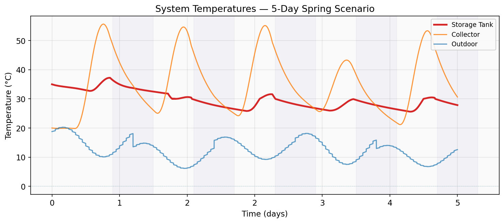
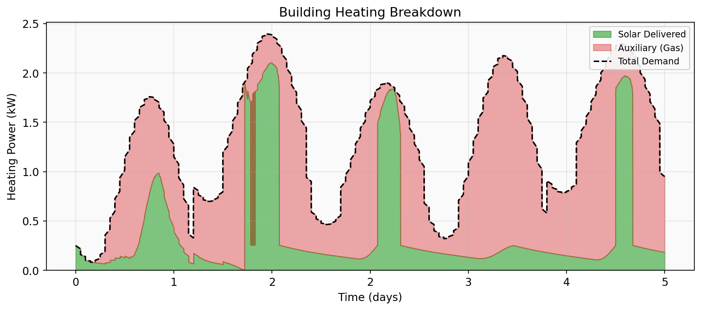
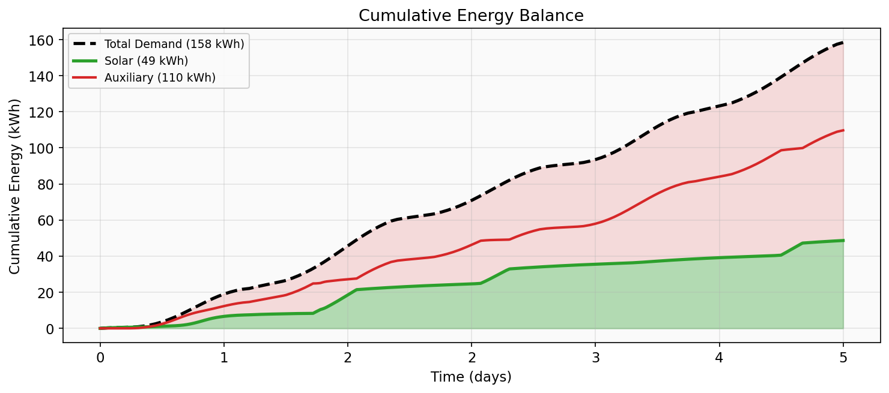
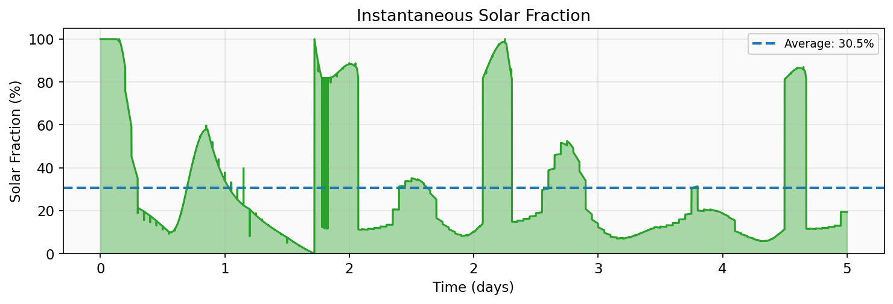
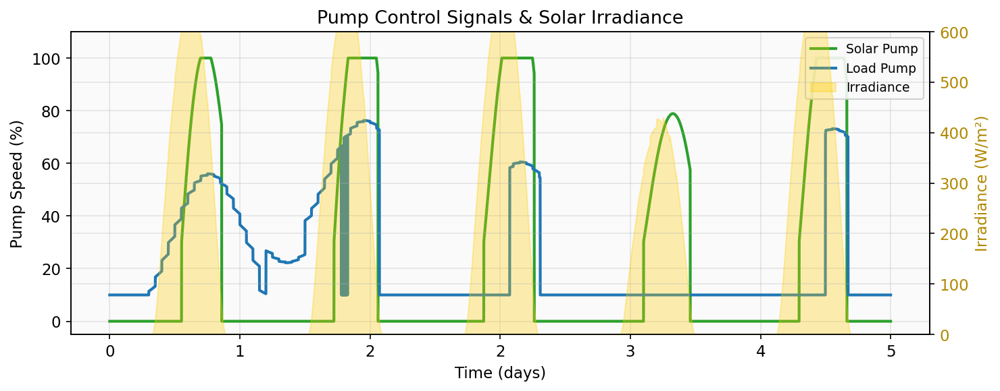

# Solar Thermal System Simulation

## Live [demo](https://solarthermalloop-hjkbwrnkthuev52nefekh6.streamlit.app/)

A physics-based simulation of a solar-assisted heating system. Two fluid loops share a central storage tank: a solar loop that collects thermal energy from the sun, and a load loop that delivers it to a building.

```
Solar Irradiance + Ambient Temp
         │
    ┌────▼──────────────┐
    │  Solar Collector  │
    └────────┬──────────┘
             │ hot fluid
    ┌────────▼──────────┐
    │   Storage Tank    │◄──── Solar pump (solar loop)
    └────────┬──────────┘
             │ warm supply
    ┌────────▼──────────┐
    │  Building / Load  │◄──── Load pump (load loop)
    └───────────────────┘
             │ cool return
             └────────────► back to tank
```

---

## Solar Loop Components

### Solar Collector — `SolarCollector`

An unglazed flat-plate collector mounted on the roof. No glass cover means higher heat loss but simpler construction and the ability to harvest ambient heat even when irradiance is low — making it a good source-booster for a heat pump.

**Energy balance (per timestep):**

```
Q_absorbed = irradiance × area × absorptance × optical_efficiency
Q_loss     = U × area × (T_collector − T_ambient)
Q_net      = Q_absorbed − Q_loss − Q_to_fluid
```

The absorber has thermal mass, so its temperature evolves:

```
dT_collector = (Q_net × dt) / (mass × cp)
```

Fluid outlet temperature is computed from a heat-exchanger effectiveness model:

```
T_outlet = T_inlet + α × (T_collector − T_inlet)    α = 0.8
```

| Parameter | Default | Notes |
|-----------|---------|-------|
| Area | 300 m² | Commercial roof array |
| Optical efficiency | 0.90 | No glazing transmission loss |
| Absorptance | 0.92 | Dark polymer/metal absorber |
| Heat loss coefficient | 15 W/(m²·K) | High — unglazed, wind-exposed |
| Thermal mass | 3000 kg | Absorber + fluid |

**Inputs:** `irradiance` (W/m²), `T_inlet` (°C), `flow_rate` (kg/s), `T_ambient` (°C)

**Outputs:** `T_outlet` (°C), `Q_collected` (W), `T_collector` (°C)

---

### Storage Tank — `StorageTank`

An insulated tank holding the water-glycol working fluid. It is the thermal buffer between collection and demand. Supports two modes:

**Fully-mixed (1 node):** Single energy balance. Fast and simple.

```
Q_solar = ṁ_solar × cp × (T_inlet_solar − T_tank)
Q_load  = ṁ_load  × cp × (T_inlet_load  − T_tank)
Q_loss  = U × A_surface × (T_tank − T_ambient)
ΔT_tank = (Q_solar + Q_load − Q_loss) × dt / (mass × cp)
```

**Stratified (N nodes):** Each node is updated separately each timestep via:

1. **Solar advection** — hot return enters top node, propagates downward
2. **Load advection** — cool return enters bottom node, propagates upward
3. **Inter-node conduction** — `Q_cond = k_eff × A_cross / Δz × ΔT`
4. **Standby losses** — per-node heat loss to ambient
5. **Buoyancy mixing** — an O(N) stack pass enforces stable stratification (hot on top)

| Parameter | Default | Notes |
|-----------|---------|-------|
| Volume | 15 m³ | ~15,000 L commercial tank |
| Mass | 15,450 kg | 30% propylene glycol mixture |
| Specific heat | 3700 J/(kg·K) | Water-glycol at ~20°C |
| Heat loss coef. | 0.5 W/(m²·K) | Well-insulated (~100mm foam) |
| Nodes | 1 (upgradeable) | Set `num_nodes > 1` for stratification |

**Inputs:** `T_inlet_solar`, `flow_rate_solar`, `T_inlet_load`, `flow_rate_load`, `T_ambient`

**Outputs:** `T_tank`, `T_outlet_solar`, `T_outlet_load`, `Q_solar`, `Q_load`, `Q_loss`; stratified mode also reports `T_tank_top`, `T_tank_bottom`, `stratification_dT`

---

### Pump — `Pump` / `PumpWithCurve`

The basic `Pump` uses a linear flow–speed relationship. `PumpWithCurve` adds a realistic quadratic H–Q curve with efficiency and power consumption:

```
H(Q)  = H_shutoff × speed² − k × Q²       (quadratic pump curve)
η(Q)  = η_BEP × (1 − 0.7 × (Q/Q_BEP − 1)²)   (parabolic efficiency)
P     = ρ × g × Q × H / η                 (shaft power, W)
```

Speed scaling follows the affinity laws: flow ∝ speed, head ∝ speed², power ∝ speed³.

**Inputs:** `speed` (0–1)

**Outputs:** `flow_rate` (kg/s), `head` (m), `efficiency` (–), `power` (W)

---

### Heat Pump — `HeatPump`

Acts as a configurable heat sink on the storage tank (evaporator side). COP is calculated from a fraction of the Carnot limit:

```
COP_Carnot = T_supply_K / (T_supply_K − T_tank_K)
COP_actual = carnot_fraction × COP_Carnot      (clipped to 1.5–8.0)

Q_evaporator = Q_heating × (1 − 1/COP)
W_compressor = Q_heating / COP
```

| Parameter | Default |
|-----------|---------|
| Heating capacity | 300 kW |
| Carnot fraction | 0.45 |
| Supply temperature | 45°C |
| Min source temp | −10°C |

**Inputs:** `T_tank` (°C), `Q_demand` (W)

**Outputs:** `Q_heating`, `Q_evaporator`, `W_compressor`, `COP`

---

## System Inputs

### Solar Radiation Model — `SolarRadiationModel`

Computes irradiance on a tilted surface from first principles.

**Sun position** (Cooper's equation + equation of time correction):
```
δ = 23.45° × sin(360° × (284 + day) / 365)        (declination)
h = arcsin(sin δ sin φ + cos δ cos φ cos ω)        (altitude angle)
```

**Clear-sky DNI** via air-mass model:
```
AM  = 1 / (sin h + 0.506 × (h + 6.08)^−1.636)
DNI = 1367 × 0.7^AM × exp(−elevation / 8400)
```

**Tilted-surface irradiance** sums direct, diffuse (isotropic sky), and ground-reflected components:
```
I_direct  = DNI × cos(incidence angle) × (1 − cloud_cover)
I_diffuse = DHI × (1 + cos tilt) / 2 × (1 + cloud_cover)
I_ground  = GHI × 0.2 × (1 − cos tilt) / 2
```

**Inputs:** latitude, longitude, elevation, day of year, time of day, cloud cover (0–1), panel tilt & azimuth

**Outputs:** `total` irradiance (W/m²), `direct`, `diffuse`, `ground`, solar `altitude`, `azimuth`, `DNI`

---

### Building Demand — `ThermalLoad` / `BuildingThermalMass`

Two interchangeable building models sharing the same interface:

**`ThermalLoad`** — simple scheduled load. Returns a Q_demand based on the time of day:
- `constant` — fixed base load
- `variable` — higher during morning and evening peaks
- `scheduled` — morning/evening peaks with overnight setback

Outlet temperature is computed from the demand: `T_outlet = T_inlet − Q_demand / (ṁ × cp)`, capped at 20°C drop.

**`BuildingThermalMass`** — full energy balance on the building envelope:
```
Q_loss     = UA_envelope × (T_building − T_ambient)
Q_solar    = irradiance × window_area × SHGC
Q_net      = Q_delivered + Q_solar + Q_internal_gains − Q_loss
dT_building = Q_net × dt / (mass × cp)
```
Heating demand is determined by a thermostat with deadband; proportional control scales required power to the temperature error.

| Parameter | `BuildingThermalMass` default |
|-----------|-------------------------------|
| Floor area | 10,000 m² |
| Thermal mass | 500,000 kg (heavy concrete) |
| UA envelope | 3,500 W/K |
| Internal gains | 150 kW (occupants + equipment) |
| Setpoint | 21°C with ±1°C deadband |
| Window area | 500 m² (effective solar aperture) |

**Inputs:** `T_inlet`, `flow_rate`, `T_ambient`, `irradiance`, `time_hours`

**Outputs:** `Q_demand`, `Q_actual`, `T_outlet`, `T_building` (thermal mass only), `load_fraction`

---

## Putting It Together — Demonstrations

### Simulation Loop

Each timestep (dt = 60 s) executes in order:

```
1. Compute weather → T_ambient, cloud_cover
2. Solar model    → irradiance on collector
3. Controller     → read T_collector, T_tank, Q_demand → compute pump speeds
4. Pump update    → speed → flow_rate
5. Collector      → T_outlet, Q_collected
6. Building       → Q_demand, T_outlet_load
7. Tank           → absorb solar, discharge to load, lose standby heat
8. Log results
```

### Spring Shoulder-Season Scenario (primary demo)

A 5-day simulation of a commercial building in early March. The solar loop provides a meaningful fraction of daily heating demand.

**Configuration:**
- Location: 40°N, 105°W, 1,600 m elevation (Denver area)
- Collector: 300 m² unglazed, 50° tilt south-facing
- Tank: 15 m³ water-glycol
- Building: 10,000 m² commercial, 300 kW heat pump

**Typical results:**

| Metric | Value |
|--------|-------|
| Building demand | ~140–170 kWh (5 days) |
| Solar delivered | ~30–45 kWh |
| Solar fraction | ~25% |
| Tank temperature | 20–45°C range |

---

## System Architecture

Components share a uniform interface:

```python
component.update(dt, inputs)  # → outputs dict
component.get_state()         # → current state dict
```

This makes swapping models straightforward — the system integration code doesn't change.

**Example — enabling tank stratification:**

```python
# Before: fully-mixed
tank = StorageTank("Tank", StorageTankParams(volume=15.0, num_nodes=1))

# After: 10-node stratified (same interface, richer physics)
tank = StorageTank("Tank", StorageTankParams(volume=15.0, num_nodes=10))
```

**Example — swapping the building model:**

```python
# Simple: scheduled load profile
building = ThermalLoad("Building", ThermalLoadParams(load_profile='scheduled'))

# Detailed: full thermal mass energy balance
building = BuildingThermalMass("Building", BuildingParams())
```

**Upgrade paths:**

| Current | Drop-in Upgrade |
|---------|----------------|
| Fully-mixed tank | Stratified N-node tank |
| Simple pump (linear) | `PumpWithCurve` (quadratic H-Q, efficiency) |
| `ThermalLoad` (profile) | `BuildingThermalMass` (energy balance) |
| Fixed fluid properties | Temperature-dependent ρ, cp, μ |
| `BasicController` | `PIDController` or `OptimizingController` (MPC) |

---

## Project Structure

```
src/
├── components.py   # SolarCollector, StorageTank, Pump, Valve, HeatPump, ThermalLoad
├── models.py       # SolarRadiationModel, PumpWithCurve, BuildingThermalMass, WeatherForecast
└── control.py      # BasicController, SAHPController, PIDController, OptimizingController

examples/
├── winter_scenario.py          # ★ Primary demo — 5-day heating scenario
├── realistic_simulation.py     # Summer scenario
├── modular_simulation.py       # Component swap demonstration
└── example_upgrade.py          # Stratified tank upgrade

tests/
├── test_solar_radiation.py     # Sun position, irradiance (15 tests)
├── test_components.py          # Energy balance, physics (18 tests)
├── test_pumps.py               # Pump curves, efficiency (8 tests)
├── test_integration.py         # System-level validation (10 tests)
├── test_heat_pump.py           # COP and energy balance
└── test_stratification.py      # Stratified tank mixing
```

### Quick Start

```bash
uv sync
uv run examples/winter_scenario.py   # primary demo
cd tests && pytest -v                 # run all tests
```

**Physics fidelity summary:**

| Model | Fidelity | Notes |
|-------|----------|-------|
| Solar radiation | High | Geographic sun position, air mass, cloud attenuation |
| Pump performance | High | Quadratic H-Q, efficiency map, affinity laws |
| Solar collector | Medium | Effectiveness model, thermal mass; no IAM or wind correction |
| Storage tank | Medium–High | Fully-mixed or stratified with buoyancy mixing |
| Building load | Medium–High | Profile or full UA + thermal mass energy balance |
| Fluid properties | Medium | 30% propylene glycol; mild temperature dependence on cp |

---

## Environment Model

The simulation generates synthetic but realistic weather over the simulation window.

**Temperature:** Sinusoidal daily profile with random day-to-day variation.
```
T(t) = T_avg − T_amp × cos(2π × (hour − 15) / 24)
```

**Cloud cover:** Stochastically assigned per day (70% chance of mostly-clear: 0.1–0.3, otherwise partly cloudy: 0.4–0.8) with a diurnal sinusoidal variation superimposed.

Both weather streams are accessible ahead of time via `WeatherForecast`, which generates the full sequence at initialization — enabling a future MPC controller to look ahead.

**Boundary conditions on components:**
- Collector heat loss driven by `T_collector − T_ambient`
- Tank standby loss driven by `T_tank − T_ambient`
- Building demand driven by `T_setpoint − T_outdoor`

---

## Controller

### `BasicController`

Differential temperature control with hysteresis — the standard proven approach for solar thermal systems.

**Solar pump logic:**
```
dT = T_collector − T_tank

Turn ON  if: dT > threshold  AND  irradiance > 100 W/m²  AND  T_tank < T_max
Keep ON  if: dT > 0.5 × threshold  (hysteresis band — prevents short-cycling)
Turn OFF if: dT < 0.5 × threshold  OR  T_tank ≥ T_max  OR  irradiance < 50 W/m²

Speed = clip(0.3 + (dT − threshold) / 20, 0.3, 1.0)   (variable speed)
```

Default thresholds: `threshold = 5°C`, `T_max = 85°C`.

**Load pump logic:**
```
If Q_demand > 0 and T_tank > 30°C:
    speed = clip(Q_demand / (cp × ΔT_load × ṁ_rated), 0.1, 1.0)
Else:
    speed = 0.1   (minimum circulation)
```

### `SAHPController`

Extends the same solar pump logic with a heat pump enable signal instead of a load pump. The tank maximum temperature is lower (45°C) because the tank is a heat pump source, not a direct heating supply.

```
HP enabled if: Q_demand > 0  AND  T_tank > hp_min_source_temp (−10°C)
```

### Other Controller Strategies

| Class | Status | Description |
|-------|--------|-------------|
| `PIDController` | Template | Feedback on any scalar process variable (e.g., tank temp); includes anti-windup |
| `OptimizingController` | Placeholder | Hook for MPC — currently delegates to `BasicController`; weather forecast data is already available |

All controllers share the same interface:

```python
control_signals = controller.compute_control(system_state)
```

Swapping a controller requires no changes to the simulation loop.

---

## Results

**System Temperatures**



*Collector (orange) swings well above the tank temperature (red) during each sunny period, driving the solar pump. Both cool overnight. Shaded bands indicate nighttime.*

---

**Building Heating Breakdown**



*Stacked area showing solar thermal contribution (green) vs auxiliary heating (red) each hour. Demand peaks overnight when outdoor temperatures drop.*

---

**Cumulative Energy Balance**



*Running totals of building demand, solar delivered, and auxiliary heating over the 5-day window. The gap between demand and solar is covered by the heat pump.*

---

**Solar Fraction**



*Instantaneous solar fraction with daily average line. Higher fractions occur midday on clear days; the system averages ~25% over the simulation period.*

---

**Control Signals**



*Solar pump speed (green) activates during daylight hours when the collector-to-tank ΔT exceeds the hysteresis threshold. Load pump (blue) modulates with building demand. Yellow fill shows incident solar irradiance.*

---

**Full Dashboard**


*Multi-panel overview with all channels: temperatures, energy flows, pump states, COP, and cumulative totals.*
