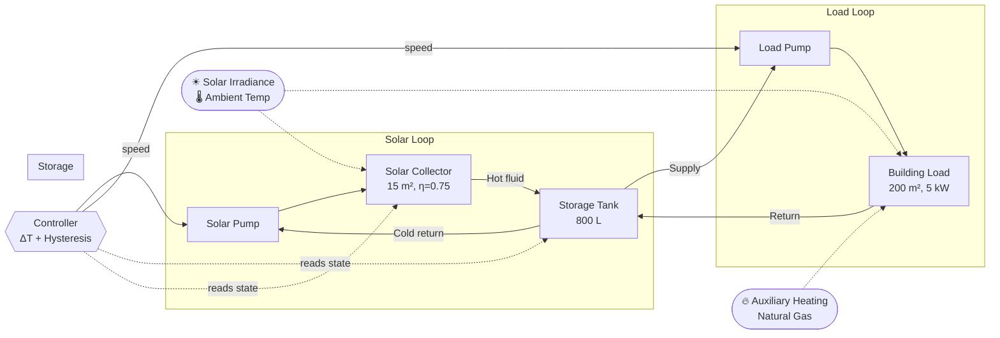
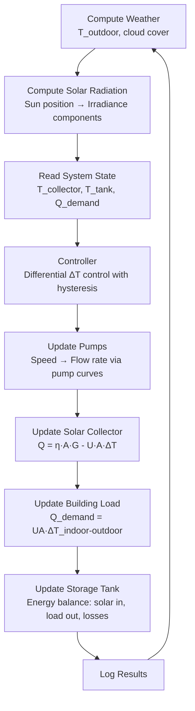
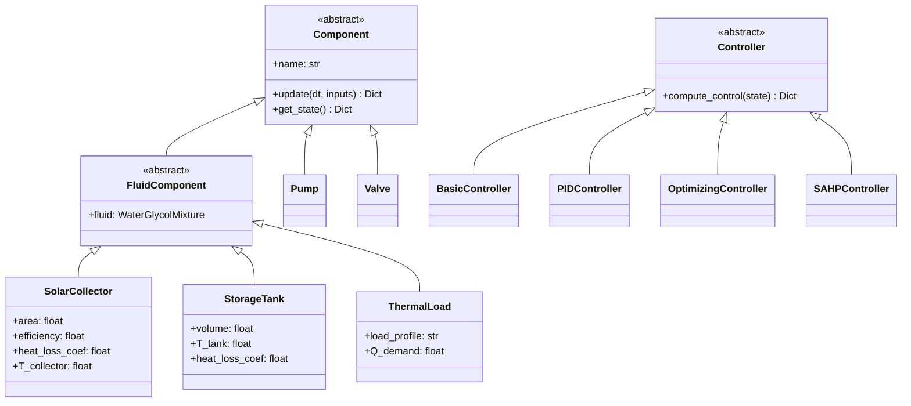
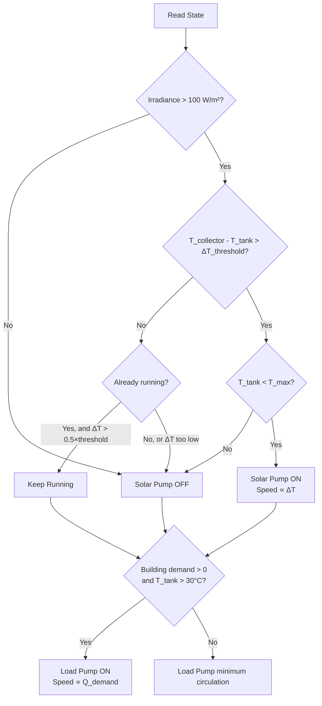
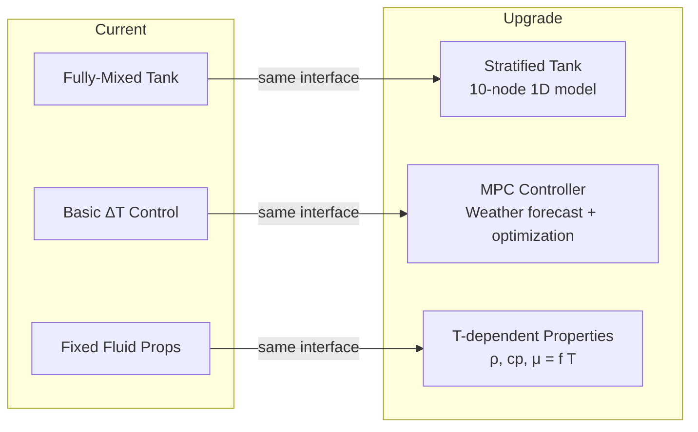

# Solar Thermal System Simulation

**Version 2.0** — Modular, component-based architecture with realistic physics

A thermodynamically accurate simulation of a solar-assisted heating system. Each physical component (collector, tank, building, pumps) is modeled as an independent module with validated energy-balance closure, allowing components to be swapped or upgraded without changing the system integration code.

---

## System Architecture

The system models two fluid loops connected through a central storage tank:



**Solar loop** — A pump circulates water-glycol (cp = 3500 J/kg-K) from the bottom of the storage tank through an unglazed solar collector and back. The controller enables this pump only when the collector-to-tank temperature differential exceeds a threshold (with hysteresis to prevent short-cycling).

**Load loop** — A second pump draws hot water from the tank to satisfy building heating demand. Any shortfall is covered by auxiliary heating (natural gas at $0.04/kWh). Flow is modulated based on the current thermal load.

---

## Simulation Loop

Each timestep (default dt = 60 s) proceeds through the following sequence:



---

## Component Overview

### Class Hierarchy



### Component Details

| Component | Key Physics | Inputs | Outputs |
|-----------|------------|--------|---------|
| **SolarCollector** | Q = η·A·G - U·A·(T_c - T_amb), thermal mass | irradiance, T_inlet, flow_rate, T_ambient | T_outlet, Q_collected |
| **StorageTank** | Fully-mixed energy balance, standby losses | T_inlet (solar & load), flow_rates | T_tank, Q_solar, Q_load, Q_loss |
| **ThermalLoad** | Q = UA·(T_set - T_outdoor), occupancy schedule | T_supply, flow_rate, T_outdoor | Q_demand, Q_delivered, Q_auxiliary |
| **PumpWithCurve** | Quadratic H-Q curve, P = ρgQH/η, affinity laws | speed (0–1) | flow_rate, head, power, efficiency |
| **BasicController** | Differential ΔT with hysteresis, overtemp protection | T_collector, T_tank, Q_demand | pump speeds, valve positions |

---

## Results — Spring Shoulder-Season Scenario

The primary demonstration is a **5-day spring simulation** of a residential solar thermal system where the solar loop provides a meaningful share of the building's heating demand.

**Configuration:**
- Location: 40°N, 105°W, 1600 m elevation (Denver area)
- Solar collector: 15 m² unglazed, panel tilt 50°
- Storage tank: 800 L, 1.0 W/(m²·K) insulation
- Building: 200 m², 5 kW design load at -10°C
- Season: Early March (day 75), baseline 5°C

**Typical Results** (exact values vary — weather is synthetically generated):

| Metric | Typical Value |
|--------|---------------|
| Building demand | ~140–170 kWh |
| Solar delivered | ~30–45 kWh |
| Auxiliary (natural gas) | ~110–130 kWh |
| Solar fraction | ~25% avg |
| Operating cost (5 days) | ~$4–5 |
| Tank temperature range | 25–35°C |

### System Temperatures


*Tank temperature (red) starts at 35°C and reaches a quasi-steady daily cycle. The collector (orange) swings well above the tank during each sunny period, driving the solar pump. Shaded bands indicate nighttime.*

### Building Heating Breakdown


*Stacked area showing solar contribution (green) vs auxiliary gas heating (red). Demand peaks overnight when outdoor temperatures drop and occupancy setback ends in the morning.*

### Cumulative Energy Balance


*Running totals of building demand, solar contribution, and auxiliary heating over the full 5-day window. The gap between the solar and demand curves is covered by natural gas.*

### Control Signals


*Solar pump (green) activates during daylight hours when the collector-to-tank ΔT exceeds the hysteresis threshold. Load pump (blue) modulates with building demand. Yellow fill shows incident solar irradiance for reference.*

### Full Dashboard

The multi-panel overview with all 11 channels is also available:


---

## Results — Single-Day Baseline (v1.0)

A simpler 24-hour simulation showing the core solar collection cycle with a single collector and tank (no building load loop):


*Collector outlet leads tank temperature during the day, then both cool overnight. Cumulative energy balance shows collection closely tracking tank heat gain.*

---

## Control Logic



---

## Physics Fidelity

| Model | Fidelity | Notes |
|-------|----------|-------|
| Solar radiation | **High** | Geographic sun position (lat, lon, day, hour), direct + diffuse + ground-reflected, cloud attenuation, elevation correction |
| Pump performance | **High** | Quadratic H-Q curves, efficiency peaks at BEP, affinity laws for variable speed, realistic power consumption |
| Solar collector | **Medium** | Optical efficiency, linear heat loss, thermal mass; no IAM or wind correction |
| Storage tank | **Medium** | Fully-mixed (single-node); upgradeable to stratified multi-node |
| Building load | **Medium** | UA-based envelope model, occupancy schedule, night setback; no thermal mass |
| Fluid properties | **Medium** | Water-glycol mixture with freeze protection; properties fixed (not temperature-dependent) |

---

## Project Structure

```
PassiveLogicInterview/
├── src/                            # Source code
│   ├── __init__.py
│   ├── components.py               # Component base classes & implementations
│   ├── models.py                   # Physics models (solar radiation, pumps)
│   └── control.py                  # Controller algorithms
│
├── examples/                       # Runnable simulations
│   ├── winter_scenario.py          # ★ Primary demo — 5-day winter heating
│   ├── realistic_simulation.py     # Summer scenario
│   ├── modular_simulation.py       # Modular architecture demo
│   ├── example_upgrade.py          # Component upgrade demo
│   └── solar_thermal_simulation.py # Baseline v1.0 (self-contained)
│
├── tests/                          # Unit & integration tests (51+ tests)
│   ├── test_solar_radiation.py     # Sun position, irradiance (15 tests)
│   ├── test_components.py          # Energy balance, physics (18 tests)
│   ├── test_pumps.py               # Pump curves, efficiency (8 tests)
│   ├── test_integration.py         # System-level validation (10 tests)
│   ├── test_heat_pump.py           # Heat pump system tests
│   └── test_stratification.py      # Tank stratification tests
│
├── docs/                           # Extended documentation
│   ├── ARCHITECTURE.md             # System design & modularity
│   ├── WINTER_SCENARIO_SUMMARY.md  # Winter simulation analysis
│   └── PROJECT_STATUS.md           # Status & known issues
│
├── results/                        # Generated plots
│   ├── winter_scenario_results.png
│   └── solar_thermal_results.png
│
├── archive/                        # Version history (v1.0 baseline)
├── pyproject.toml                  # Project config (uv)
└── requirements.txt                # Runtime dependencies
```

---

## Quick Start

### Install & Run

```bash
# Install dependencies
uv sync

# Run the primary demo (5-day winter heating scenario)
uv run examples/winter_scenario.py

# Run all tests
cd tests && pytest -v

# Run tests with coverage
cd tests && pytest --cov=../src
```

### Dependencies

| Package | Version | Purpose |
|---------|---------|---------|
| numpy | >= 1.20.0 | Numerical computation |
| matplotlib | >= 3.3.0 | Plotting |
| pytest | >= 7.0.0 | Testing |

---

## Testing

**51+ tests** across 6 modules validate energy conservation, physical realism, and correct system behavior.

### Energy Balance Validation

| Scope | Error Bound | Status |
|-------|------------|--------|
| Solar collector | < 5% (transient effects) | Pass |
| Storage tank | < 1% | Pass |
| Full system | < 5% | Pass |

### Key Validations

- Solar altitude angles accurate to ±3° vs. analytical formulas
- Clear-sky irradiance in realistic range (900–1200 W/m²)
- Pump power matches P = ρgQH/η
- Temperature bounds enforced (no sub-freezing or super-boiling)
- Controller hysteresis prevents short-cycling

---

## Upgrade Paths

The modular architecture supports dropping in improved models without changing the system integration code:



**Example — swapping the tank model:**

```python
# Before: fully-mixed
tank = StorageTank("Tank", StorageTankParams(volume=0.3))

# After: stratified (same interface, different physics)
tank = StratifiedTank("Tank", StorageTankParams(volume=0.3), num_nodes=10)

# System code is unchanged
system = WinterHeatingSystem(collector, tank, building, controller, location)
system.run_simulation()
```

---

## Version History

| Version | Changes |
|---------|---------|
| **v2.0** | Modular architecture, realistic solar radiation model, pump performance curves, comprehensive test suite, winter heating scenario, economic analysis |
| **v1.0** | Monolithic baseline simulation (archived in `archive/v1.0_baseline/`) |
